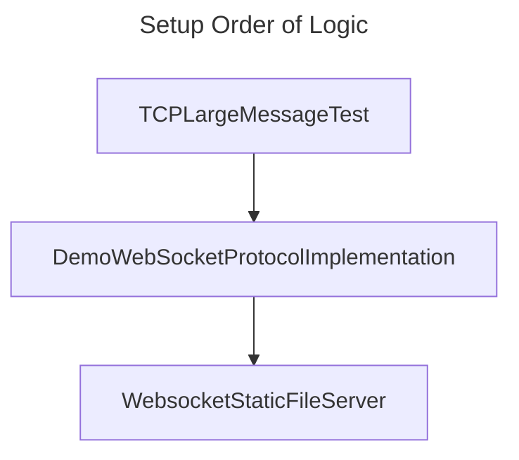

# Demo WebSocket Protocol Implementation

Implement WebSocket protocol in C# using only TCP. This is based on https://developer.mozilla.org/en-US/docs/Web/API/WebSockets_API/Writing_WebSocket_server

## References

The WebSocket Protocol is RFC 6455.

* https://developer.mozilla.org/en-US/docs/Web/API/WebSockets_API/Writing_WebSocket_servers

## Related Experiments

* https://github.com/Charles-Zhang-CSharp/WebsocketStaticFileServer
* https://github.com/Charles-Zhang-CSharp/TCPLargeMessageTest

